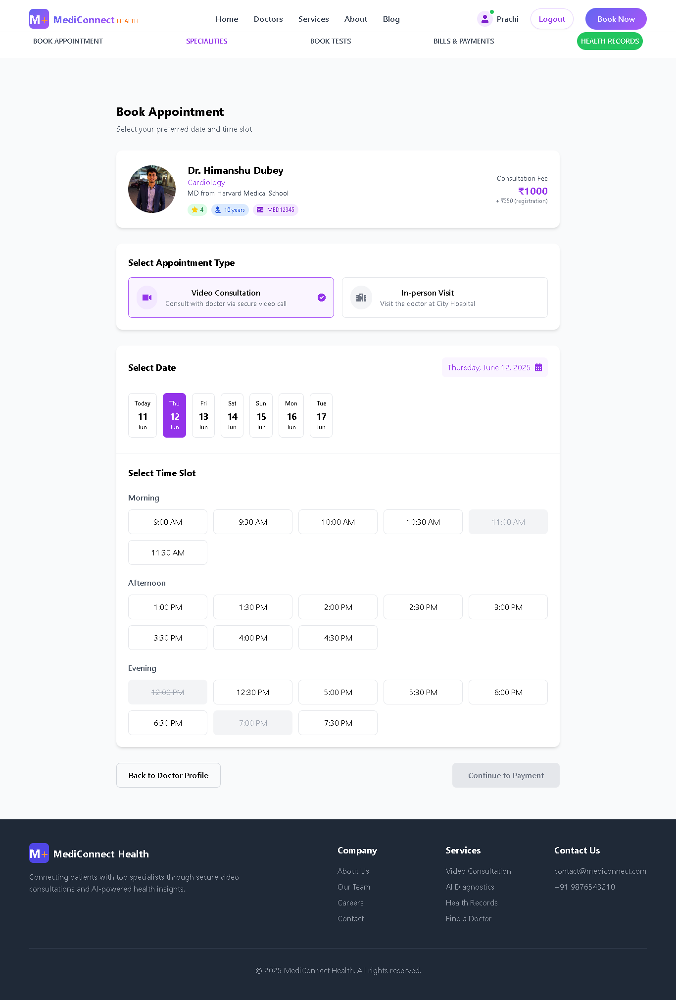
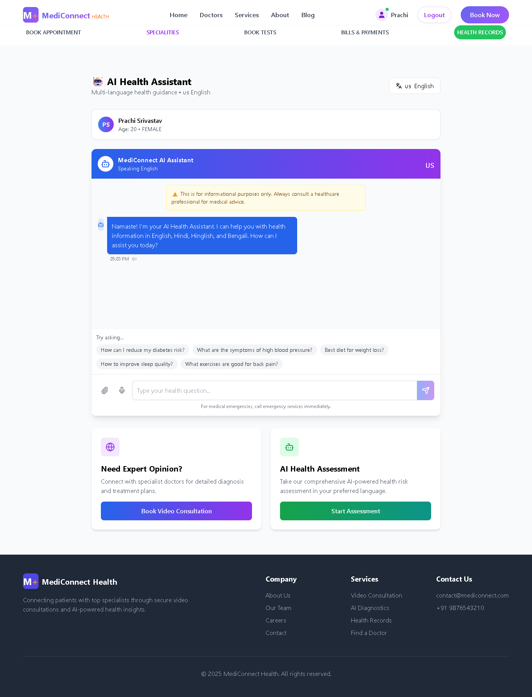
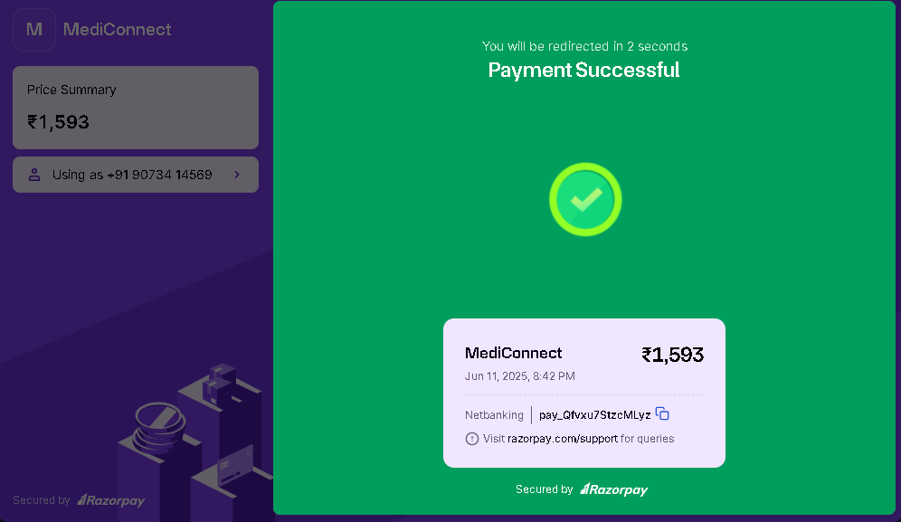
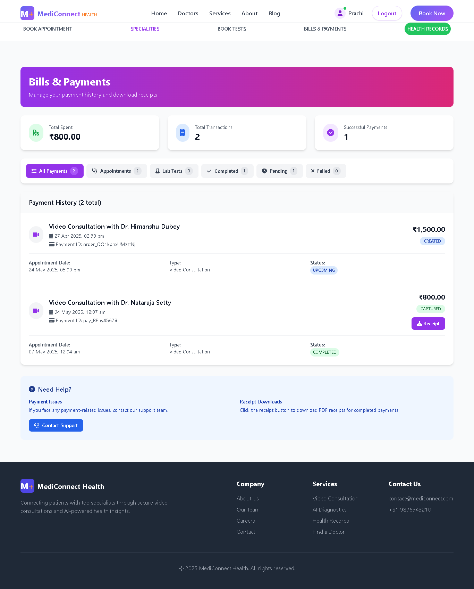
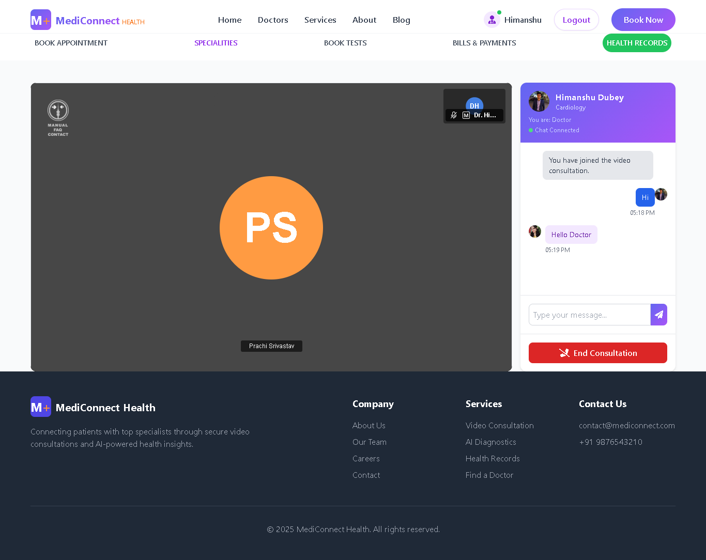
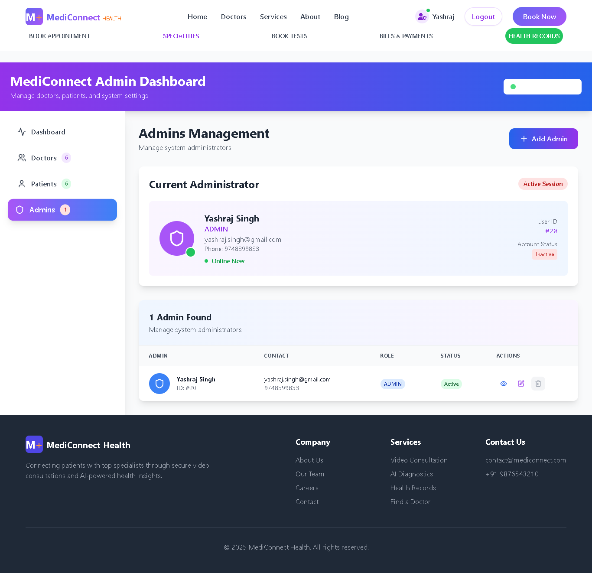

# MediConnect - AI Healthcare Platform 🏥

Complete healthcare management system with video consultation, AI-powered features, and secure medical records.

[](https://spring.io/projects/spring-boot)
[](https://reactjs.org/)
[](https://www.oracle.com/java/)
[](https://www.mysql.com/)

## 🚀 Quick Start

### Prerequisites
- Java 17+
- Node.js 16+
- MySQL 8.0+
- Maven 3.8+

### Option 1: Automated Setup (Recommended)

**Windows:**
```bash
git clone https://github.com/Yashraj-Coll/mediconnect
cd mediconnect
setup.bat
```

**Linux/Mac:**
```bash
git clone https://github.com/Yashraj-Coll/mediconnect
cd mediconnect
chmod +x setup.sh
./setup.sh
```

### Option 2: Manual Setup

#### 1. Setup Backend
```bash
# Clone backend repository
git clone https://github.com/Yashraj-Coll/mediconnect-backend
cd mediconnect-backend

# Create database
mysql -u root -p
CREATE DATABASE mediconnect;
exit;

# Configure environment
cp .env.example .env
# Edit .env with your database credentials

# Build and run
mvn clean install
mvn spring-boot:run
```

Backend will start at: `http://localhost:8080`

#### 2. Setup Frontend
```bash
# Clone frontend repository (in new terminal)
git clone https://github.com/Yashraj-Coll/mediconnect-frontend
cd mediconnect-frontend

# Install dependencies
npm install

# Configure environment
cp .env.example .env
# Edit .env with backend URL

# Start development server
npm run dev
```

Frontend will start at: `http://localhost:5173`

## 📁 Project Architecture

This is the main documentation repository. The application consists of:

### Backend Repository
[**mediconnect-backend**](https://github.com/Yashraj-Coll/mediconnect-backend) - RESTful API Server
- **Tech Stack:** Spring Boot 3.4.6, Java 17, MySQL
- **Security:** JWT Authentication, Spring Security
- **Features:** REST APIs, WebSocket, Email Service
- **Port:** 8080

### Frontend Repository
[**mediconnect-frontend**](https://github.com/Yashraj-Coll/mediconnect-frontend) - User Interface
- **Tech Stack:** React 18, Vite, TailwindCSS
- **Features:** Responsive UI, Real-time updates
- **Port:** 5173

## ✨ Key Features

### 🏥 Core Healthcare
- **Video Consultation** - Real-time doctor consultations via WebSocket
- **Appointment Booking** - Schedule and manage appointments
- **Medical Records** - Secure patient health records
- **Lab Test Management** - Order and track lab tests
- **Prescription Management** - Digital prescription generation

### 💳 Payment Integration
- **Stripe** - International payments
- **Razorpay** - Indian payment gateway
- Secure payment processing for consultations

### 📄 Document Management
- **PDF Generation** - Automated prescription and report generation
- **Document Upload** - Support for medical documents (PDF, DOC, images)
- **Document Processing** - Apache Tika integration

### 🤖 Advanced Features
- **AI Controllers** - Intelligent health insights
- **Blockchain Integration** - Secure medical record storage (Web3j)
- **Google Calendar Sync** - Appointment synchronization
- **Email Notifications** - Appointment reminders and updates
- **Vital Signs Tracking** - Monitor patient health metrics

## 🛠️ Technology Stack

### Backend
```
Framework:     Spring Boot 3.4.6
Language:      Java 17
Database:      MySQL 8.0
Security:      Spring Security + JWT
WebSocket:     STOMP over WebSocket
Email:         Spring Mail
Payments:      Stripe, Razorpay
PDF:           iText7, Flying Saucer
Blockchain:    Web3j
API Docs:      SpringDoc OpenAPI (Swagger)
```

### Frontend
```
Framework:     React 18
Build Tool:    Vite
Styling:       TailwindCSS
HTTP Client:   Axios (assumed)
Routing:       React Router (assumed)
```

## 📚 API Documentation

Once backend is running, access Swagger UI at:
```
http://localhost:8080/swagger-ui.html
```

## 🔐 Security Features

- JWT-based authentication
- Secure password hashing
- CORS configuration
- Input validation
- SQL injection prevention

## 🗄️ Database Schema

Main entities:
- Users (Patients, Doctors, Admins)
- Appointments
- Medical Records
- Prescriptions
- Lab Tests
- Payments
- Vital Signs

## 📸 Screenshots

### 🏠 Homepage

*Modern landing page with intuitive navigation and call-to-action buttons*

---

### 👨‍⚕️ Patient Portal

#### Patient Dashboard

*Comprehensive patient dashboard with appointments, health metrics, and quick actions*

#### Appointment Booking

*Easy-to-use appointment scheduling with doctor selection and time slot booking*

#### AI Health Assistant

*Intelligent AI-powered chatbot for preliminary health consultations*

#### AI Conversation Example

*Real-time symptom analysis and health recommendations through AI*

#### Payment Integration

*Secure payment processing with Razorpay gateway integration*

#### Bills & Payments Management

*Complete payment history with receipt downloads and transaction tracking*

> 💡 **PDF Receipt Generation:** Automated lab test and consultation receipts are generated and sent via email after successful payment.

#### Health Records Management

*Secure digital health records - view, download, and manage all medical documents*

#### Video Consultation (Patient View)

*High-quality video consultation interface from patient's perspective*

---

### 🩺 Doctor Portal

#### Doctor Dashboard

*Doctor's control panel with appointment management, patient queue, and analytics*

#### Doctor Profile & Appointment Details

*Detailed doctor profile with specializations, availability, and patient reviews*

#### Video Consultation (Doctor View)

*Professional video consultation interface with patient medical records access*

---

### 👨‍💼 Admin Portal

#### Admin Dashboard

*Comprehensive admin panel for system management, user administration, and analytics*

---

### 🔐 Security Features

#### Password Reset with OTP

*Secure password reset flow with OTP verification via email*

> 🔒 **Email Integration:** System sends automated emails for:
> - OTP verification
> - Password reset confirmation  
> - Appointment confirmations
> - Payment receipts (PDF attachments)
> - Lab test results

---

### 📄 Sample Documents

#### Lab Test Receipt (PDF)
*Automatically generated PDF receipt sent via email after payment*

**Receipt includes:**
- Patient details and contact information
- Lab test details with pricing
- Payment information (Razorpay transaction ID)
- GST breakdown
- Digital signature and company branding

[View Sample Receipt](docs/screenshots/sample-pdf-receipt.pdf)

---
## 🌐 Deployment

### Backend
- Dockerized deployment ready
- Deployed on: 

### Frontend
- Optimized Vite build
- Deployed on: 

## 🧪 Testing

### Backend
```bash
cd mediconnect-backend
mvn test
```

### Frontend
```bash
cd mediconnect-frontend
npm test
```

## 📝 Environment Variables

### Backend (.env)
```env
# Database
DATABASE_URL=jdbc:mysql://localhost:3306/mediconnect
DATABASE_USERNAME=root
DATABASE_PASSWORD=your_password

# JWT
JWT_SECRET=your_jwt_secret_key_here

# Email
MAIL_USERNAME=your_email@gmail.com
MAIL_PASSWORD=your_app_password

# Payment Gateways
STRIPE_SECRET_KEY=your_stripe_secret
RAZORPAY_KEY_ID=your_razorpay_key
RAZORPAY_KEY_SECRET=your_razorpay_secret

# Google Calendar (optional)
GOOGLE_CLIENT_ID=your_client_id
GOOGLE_CLIENT_SECRET=your_client_secret
```

### Frontend (.env)
```env
VITE_API_URL=http://localhost:8080
VITE_WS_URL=ws://localhost:8080/ws
```

## 🤝 For Recruiters & Engineers

### Quick Demo Setup (5 minutes)
1. Run automated setup script
2. Access app at `http://localhost:5173`
3. Default test credentials will be provided

### Project Highlights
- **Built:** Final semester BCA project at Techno Main Salt Lake, Kolkata
- **Problem Solved:** Streamlined appointment booking across multiple clinics
- **Scale:** Handles video consultations, payments, and medical records
- **Architecture:** Microservices-ready with separate frontend/backend

### Technical Decisions
- **Spring Boot 3.4.6:** Latest features and security patches
- **MySQL:** ACID compliance for critical healthcare data
- **Vite:** Fast build times and HMR for development
- **JWT:** Stateless authentication for scalability
- **WebSocket:** Real-time video consultation support

## 🐛 Known Issues & Roadmap

### Current Limitations
- Video quality optimization in progress
- Mobile responsiveness needs refinement
- AI features in beta testing phase

### Planned Features
- [ ] Multi-language support
- [ ] Mobile app (React Native)
- [ ] Advanced analytics dashboard
- [ ] Telemedicine API integration

## 👨‍💻 Developer

**Yashraj**
- **Education:** BCA Graduate, Techno Main Salt Lake (2025)
- **LinkedIn:** https://linkedin.com/in/yashraj-singh-dev
- **Email:** yashrajsingh.mail@gmail.com
- **Portfolio:** 

## 📄 License

This project is licensed under the MIT License - see the LICENSE file for details.

## 🙏 Acknowledgments

- Spring Boot documentation
- React community
- Techno Main Salt Lake faculty

---

**⭐ If you find this project interesting, please star the repositories!**

[Backend Repo](https://github.com/Yashraj-Coll/mediconnect-backend) • [Frontend Repo](https://github.com/Yashraj-Coll/mediconnect-frontend)